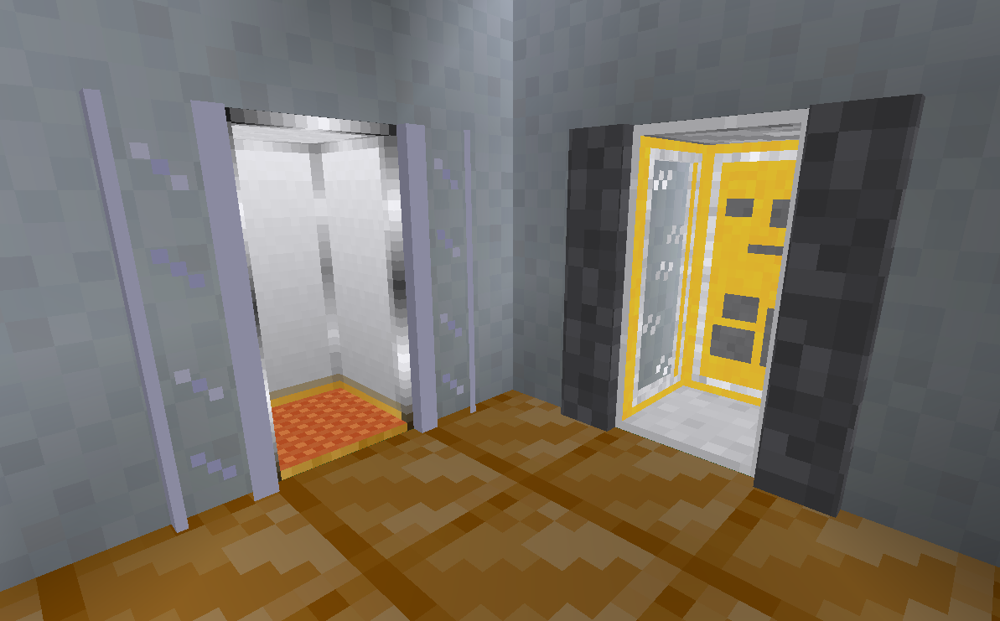
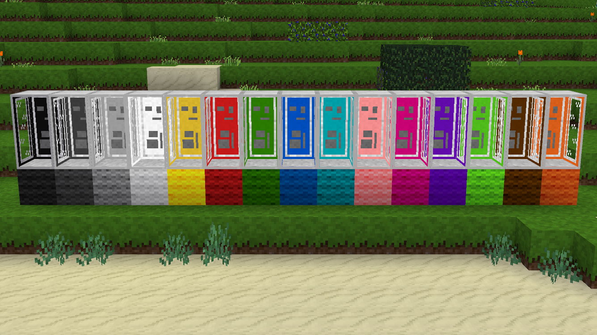
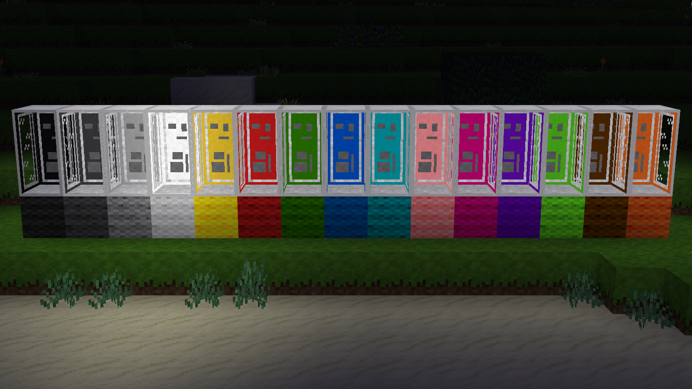

# Travelnet

## How this works

- craft it by filling the right and left column with glass; place in the middle column (from top to bottom): steel, mese, steel
  - MineClone 2: use a redstone block instead of mese
- place the travelnet box somewhere
- right-click on it; enter name of the station (e.g. "my house", "center of desert city") and name of the network (e.g. "intresting towns","my buildings")
- punch it to update the list of stations on that network
- right-click to use the travelbox

An unconfigured travelnet box can be configured by anyone. If it is misconfigured, just dig it and place it anew.
All stations that have the same network name set and are owned by the same user connect to the same network.

## Documentation

* [API](./doc/api.md)

## Screenshots

## License

The mod was written by me, Sokomine, and includes small contributions from other contributors.
License: GPLv3 (see [`LICENSE`](https://github.com/mt-mods/travelnet/blob/master/LICENSE) for more information)

The models and textures as found in the textures/ and models/ folders where created by VanessaE
and are provided under the [CC0](https://creativecommons.org/publicdomain/zero/1.0/) license.

Exceptions:

* `textures/travelnet_top.png` [CC BY-SA 3.0](https://creativecommons.org/licenses/by-sa/3.0/) https://github.com/minetest/minetest_game (`default_steel_block.png`)
* `textures/travelnet_bottom.png` [CC BY-SA 3.0](https://creativecommons.org/licenses/by-sa/3.0/) https://github.com/minetest/minetest_game (`default_clay.png`)
